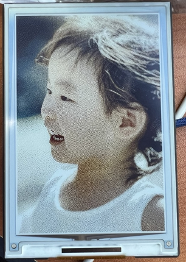

# ESP32 one 보드 기반의 4inch E Ink Spectra 6 (E6) Full color E-Paper Display를 이용한 전자액자.

## 구매정보
[4inch e-paper](https://www.waveshare.com/product/displays/e-paper/4inch-e-paper-hat-plus-e.htm)

[ESP32 one](https://www.waveshare.com/esp32-one.htm)

SD카드

## 사용 기술
- PSRAM
- SPI
- SD Card
- E-Paper Display
- wifi
- Webserver
- NodeJS(react)

## 제공 기능
- 웹페이지 기반의 사진 업로드 페이지 제공
- 업로드 페이지 내에서 이미지 리사이징 제공
- 업로드 페이지 내에서 이미지 디더링 제공
- 업로드된 이미지가 표시 가능할 경우 리셋 시에 이미지 변경 기능 제공

# 준비 중
- 업로드된 이미지가 표시 가능할 경우 일정 시간마다 이미지 변경 기능 제공
- USB 연결을 감지해서 충전 혹은 외부 전원 연결 시에만 웹서버 제공

